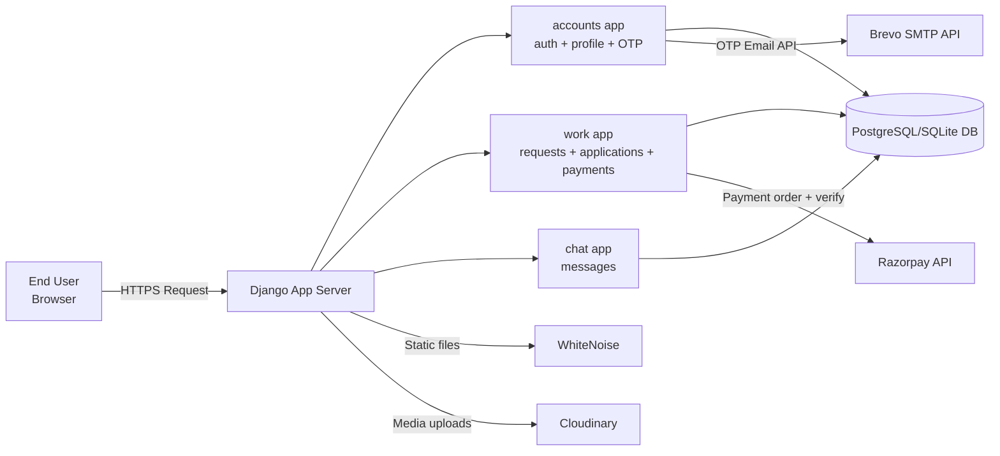
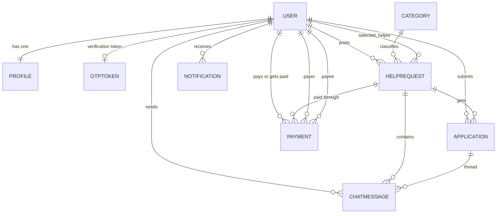
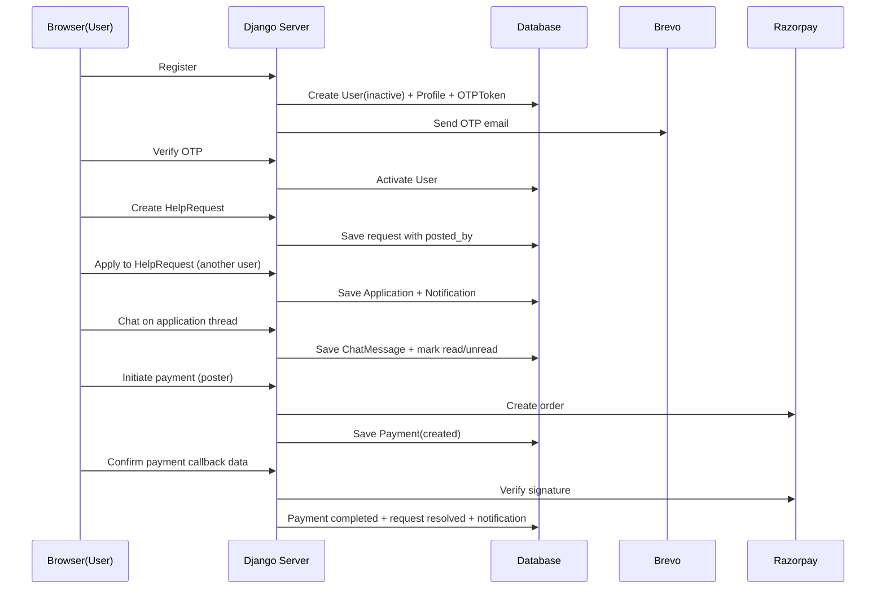

# NxtHelp Project Structure Diagram and Detailed Report

This document explains how users, data, and server modules are connected in the `nxthelp` project.

## 1) Big-Picture Architecture



## 2) URL Routing Structure

```mermaid
flowchart TD
    ROOT[nxthelp/urls.py]
    ROOT --> A[accounts.urls]
    ROOT --> W[work.urls]
    ROOT --> C[chat.urls]

    A --> A1[/register/]
    A --> A2[/login/]
    A --> A3[/verify-otp/]
    A --> A4[/profile/]

    W --> W1[/dashboard/]
    W --> W2[/request/new/]
    W --> W3[/request/{id}/apply/]
    W --> W4[/request/{id}/payment/]
    W --> W5[/notifications/]

    C --> C1[/request/{id}/chat/{app_id}/]
    C --> C2[/send/]
    C --> C3[/fetch/]
    C --> C4[/my-chats/]
```

## 3) Core Data Model (How Each User Is Linked)



## 4) User Journey and Connection Flow



## 5) App-by-App Responsibility Map

- `accounts`
  - Registration/login/logout.
  - Email OTP verification (`OTPToken`).
  - User profile (`Profile`) and custom email-or-username authentication backend.
  - Signals auto-create profile when a `User` is created.

- `work`
  - Main business domain: `HelpRequest`, `Application`, `Notification`, `Payment`, `Category`.
  - Dashboard queries, request browsing, apply/withdraw, resolve/close lifecycle.
  - Razorpay order creation and payment signature verification.
  - Unread count API for chats + notifications.

- `chat`
  - Message threads scoped to a specific request application.
  - Access control: only request poster and that application's applicant can read/write.
  - Poll-style fetching (`fetch_messages`) and send endpoint (`send_message`).

## 6) Important Variables and Linking Fields

These are the key "connection variables" you asked about:

- Identity links:
  - `Profile.user -> User` (one-to-one)
  - `OTPToken.user -> User` (one-to-one)

- Request marketplace links:
  - `HelpRequest.posted_by -> User`
  - `HelpRequest.selected_helper -> User` (chosen helper)
  - `Application.help_request -> HelpRequest`
  - `Application.applicant -> User`
  - Unique rule: one applicant can apply once per request (`unique_together`).

- Chat links:
  - `ChatMessage.help_request -> HelpRequest`
  - `ChatMessage.application -> Application`
  - `ChatMessage.sender -> User`

- Payment links:
  - `Payment.help_request -> HelpRequest`
  - `Payment.payer -> User` (poster)
  - `Payment.payee -> User` (selected helper)
  - Razorpay tracking fields: `razorpay_order_id`, `razorpay_payment_id`, `razorpay_signature`.

- Notification links:
  - `Notification.recipient -> User`
  - `Notification.link` stores navigation path to relevant page.

## 7) Request Lifecycle (Startup-Style Domain State)

`HelpRequest.status` states:

1. `open` -> users can discover and apply.
2. `in_progress` -> work has started.
3. `completed` -> work done from helper side.
4. `resolved` -> resolved/finalized (often after payment confirm).
5. `closed` -> manually closed by author.

`Application.status` states:

- `pending`, `accepted`, `rejected`, `withdrawn`, `completed`.

`Payment.status` states:

- `created`, `pending`, `completed`, `failed`.

## 8) Security and Access Control Structure

- Authentication:
  - Session-based auth via Django auth middleware.
  - Custom backend allows login by username or email.
  - OTP verification keeps new/changed emails inactive until verified.

- Authorization:
  - `@login_required` on private routes.
  - Ownership checks in views for request, chat, payment, and receipts.
  - Chat access restricted to exactly two users in that thread.

- Abuse protection:
  - `django_ratelimit` on registration/login/OTP resend/apply routes.
  - Chat content sanitized using `bleach` (strips HTML tags).

## 9) Server/Infrastructure Layer

- Runtime: Django with Gunicorn.
- Static delivery: WhiteNoise.
- Database:
  - Local: SQLite.
  - Production: PostgreSQL via `DATABASE_URL`.
- Media:
  - Cloudinary (`CloudinaryField` for request image uploads).
- External APIs:
  - Brevo for OTP email delivery.
  - Razorpay for payment order and signature verification.

## 10) Recommended Next-Step Diagrams for Enterprise-Level Documentation

If you want this to look like "big startup" docs, add these next:

- C4 Model diagrams:
  - Context diagram (users, admin, payment provider, email provider).
  - Container diagram (Django app, DB, external services).
  - Component diagram for each app (`accounts`, `work`, `chat`).
- Data lifecycle diagram:
  - Exactly where each PII field is created, used, masked, and retained.
- Threat model diagram:
  - Entry points, trust boundaries, abuse scenarios, controls.
